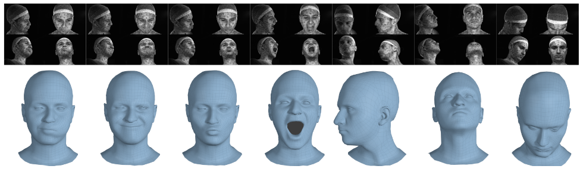
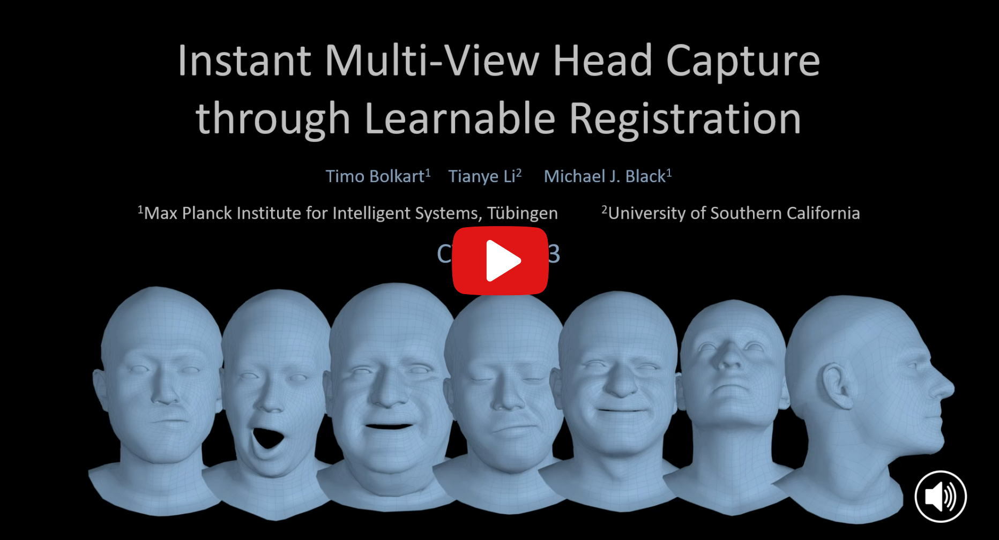

<h1 align="center">Instant Multi-View Head Capture through Learnable Registration</h1>

<p align="center">
  <a href="https://sites.google.com/site/bolkartt"><strong>Timo Bolkart</strong></a>
  ·
  <a href="https://tianyeli.github.io/"><strong>Tianye Li</strong></a>    
  ·
  <a href="https://ps.is.tuebingen.mpg.de/person/black"><strong>Michael J. Black</strong></a>
</p>
<h2 align="center">CVPR 2023</h2>

This repository is the official implementation of the [CVPR 2023](https://cvpr2023.thecvf.com/) paper [Instant Multi-View Head Capture through Learnable Registration](https://ps.is.mpg.de/uploads_file/attachment/attachment/711/CVPR2023_Multiview_Face_Capture.pdf).   

<p>
  <p align="center"> 
  
  </p>
  <strong>TEMPEH</strong>: Given calibrated multi-view images (top: 4 of 16 views; contrast enhanced for visualization), TEMPEH directly infers 3D head meshes in dense semantic correspondence (bottom) in about 0.3 seconds. TEMPEH reconstructs heads with varying expressions (left) and head poses (right) for subjects unseen during training. Applied to multi-view video input, the frame-by-frame inferred meshes are temporally coherent, making them directly applicable to full-head performance-capture applications.   
</p>

<p align="center">
  <a href='https://ps.is.mpg.de/uploads_file/attachment/attachment/711/CVPR2023_Multiview_Face_Capture.pdf'>
    
  </a> 
  <a href='https://ps.is.mpg.de/uploads_file/attachment/attachment/712/CVPR2023_Multiview_Face_Capture_supmat.pdf'>
    
  </a>     
  <a href='https://youtu.be/AolpvKpmjEw' style='padding-left: 0.5rem;'>
    
  </a>
  <a href='https://tempeh.is.tue.mpg.de/index.html' style='padding-left: 0.5rem;'>
    
  </a>
  <a href="https://pytorch.org/get-started/locally/"></a>
</p>

<h2 align="center">TL;DR</h2>

- TEMPEH reconstructs **3D heads in semantic correspondence** (i.e., in [FLAME](https://flame.is.tue.mpg.de/) mesh topology) directly from **calibrated multi-view images**.
- Predicting one head takes about **0.3 seconds**.
- TEMPEH leverages [ToFu's](https://tianyeli.github.io/tofu/paper.pdf) **volumetric feature sampling framework**.
- **Self-supervised training from scans** overcomes ambiguous correspondence across subjects and imperfect correspondence across expressions.
- A spatial transformer module **localizes the head in the feature volume**, which enables the handling of a large capture volumes by focusing on the region of interest.
- A **surface-aware feature fusion** accounts for self-occlusions.


<h2 align="center">Video</h2>

<div align="center">
  <a href="https://youtu.be/AolpvKpmjEw" target="_blank">
    
  </a>
</div>


<h2 align="center">Setup</h2>

<details>
<summary>Installing TEMPEH</summary>

TEMPEH is tested in a Python 3.7 environment with PyTorch 1.12.1 for CUDA 11.6.


Set up and activate the virtual environment:
```
# Set up virtualenv
mkdir <your_home_dir>/.virtualenvs
python3.7 -m venv <your_home_dir>/.virtualenvs/TEMPEH

# Activate virtualenv 
cd TEMPEH
source <your_home_dir>/.virtualenvs/TEMPEH/bin/activate
```

Adjust the pip version (higher pip versions result in errors in the later [MPI-IS/mesh](https://github.com/MPI-IS/mesh) installation) and append the current working directory:
```
pip install -U pip==22.0.4
echo $(pwd) >> <your_home_dir>/.virtualenvs/TEMPEH/lib/python3.7/site-packages/tempeh.pth
```

Install a [PyTorch](https://pytorch.org/get-started/locally/) and [Kaolin](https://github.com/NVIDIAGameWorks/kaolin) version that suit you. We tested with PyTorch 1.12.1 and Kaolin 1.13.
```
pip install torch==1.12.1+cu116 torchvision==0.13.1+cu116 torchaudio==0.12.1 --extra-index-url https://download.pytorch.org/whl/cu116
pip install kaolin==0.13.0 -f https://nvidia-kaolin.s3.us-east-2.amazonaws.com/torch-1.12.1_cu116.html
```

Install mesh processing libraries from [MPI-IS/mesh](https://github.com/MPI-IS/mesh) within the virtual environment.

Install the liegroups:
```
cd modules/liegroups && python setup.py install && cd -
```

Install the remaining requirements with:
```
pip install -r requirements.txt
```
</details>


<h2 align="center">Data</h2>

We provide the trained models, test and training set of the FaMoS dataset. For the datasets, you must register at [https://tempeh.is.tue.mpg.de/](https://tempeh.is.tue.mpg.de/) and agree to the TEMPEH license terms. Then you can use your login credential to download the datasets with the following scripts.


<details>
<summary>Data for testing </summary>

**Pretrained models**

Fetch the pre-trained TEMPEH coarse (700 MB) and refinement models (600 MB) with:
```
./fetch_TEMPEH_models.sh
```
Running this will download the models into './data/downloads' and then extract them to './runs/coarse' and './runs/refinement'.


**Example FaMoS test set**

For downloading a small test set containing the data shown in the paper, run:
```
./fetch_test_subset.sh
```
Running this will download the data into './data/downloads' and then extract the data to './data/test_data_subset'.

**Full FaMoS test set**

For downloading the entire FaMoS test dataset (18 GB), run:
```
./fetch_test_data.sh
```
Running this will download the data into './data/downloads' and then extract the data to './data/test_data'. The archives are extrated with [7z](https://www.7-zip.org/) which must be installed prior to running the script. 

</details>


<details>
<summary>Data for training </summary>

For downloading the FaMoS training dataset (images: 194 GB, scans: 205 GB, registrations: 86 GB), run:
```
./fetch_training_data.sh
```
Running this will download the training data into './data/downloads' (default) and then extract the data to './data/training_data' (default). To specifify different download and data directories, edit the 'fetch_training_data.sh' script. Extracting all data requires about 500 GB of disk space. After running the script, ensure that all data packages are successfully downloaded, and that the extraction of the data was successful. 

To download only images, scans, or registrations, run either of the following:
```
./fetch_training_image.sh
./fetch_training_scans.sh
./fetch_registrations.sh
```

</details>


<h2 align="center">Demo</h2>


TEMPEH predicts 3D faces from multi-view images in two stages, a coarse stage followed by a geometry refinement. We provide testing and training codes for TEMPEH.

<details>
<summary>Testing</summary>

**Step 1: Coarse stage inference**
```
python tester/test_global.py \
--coarse_model_run_dir './runs/coarse/coarse__TEMPEH_final' \
--data_list_fname './data/test_data_subset/paper_test_frames.json' \
--image_directory './data/test_data_subset/test_subset_images_4' \
--calibration_directory './data/test_data_subset/test_subset_calibrations' \
--out_dir './results/FaMoS_test_subset/coarse__TEMPEH_final'
```

**Step 2: Refinement stage inference**
```
python tester/test_local.py \
--refinement_model_run_dir './runs/refinement/refinement_TEMPEH_final' \
--data_list_fname './data/test_data_subset/paper_test_frames.json' \
--coarse_prediction_root_dir './results/FaMoS_test_subset/coarse__TEMPEH_final' \
--image_directory './data/test_data_subset/test_subset_images_4' \
--calibration_directory './data/test_data_subset/test_subset_calibrations' \
--out_dir './results/FaMoS_test_subset/refinement__TEMPEH_final'
```
</details>


<details>
<summary>Training</summary>

**Step 1: Coarse stage training - Part 1**

TEMPEH's coarse model is firstly pre-trained fully-supervised with a vertex-to-vertex loss for 300K iterations. 
Adapt the paths for the training data `train-data-list-fname`, `val-data-list-fname`, `scan-directory`, `processed-directory`, `image-directory`, `calibration-directory` in the `option_handler/train_options_global.py` and run:
```
python trainer/train_global.py --num-iterations 300000
```

**Step 2: Coarse stage training - Part 2**

After pre-training, training TEMPEH additionally minimizes the point-to-surface distance and an edge-based regularization. 
To resume the training, add the option `--config-filename <CONFIG_FNAME>` with the config file from pre-training (default: `./runs/coarse/coarse__TEMPEH__<<DATE>>/config.json`) and run:
```
python trainer/train_global.py \
--config-filename <CONFIG_FNAME> \
--num-iterations 800000 \
--weight-points2surface 10.0 \
--weight-edge-regularizer 1.0 \
--point-mask-weights '{"w_point_face": 0.0, "w_point_ears": 0.0, "w_point_eyeballs": 1.0, "w_point_eye_region": 0.0, "w_point_lips": 0.0, "w_point_neck": 0.0, "w_point_nostrils": 0.0, "w_point_scalp": 0.0,"w_point_boundary": 0.0}'
```

**Step 3: Cache coarse training and validation predictions**

Prior to training the refinement model, output the predictions for all training and validationd data:
```
# training data
python tester/test_global.py \
--coarse_model_run_dir './runs/coarse/coarse__TEMPEH__<<DATE>>' \
--data_list_fname './data/training_data/seventy_subj__all_seq_frames_per_seq_40_head_rot_120_train.json' \
--image_directory  './data/training_data/train_images_4' \
--calibration_directory './data/training_data/train_calibrations' \
--out_dir './results/FaMoS_training_predictions'

# validation data
python tester/test_global.py \
--coarse_model_run_dir './runs/coarse/coarse__TEMPEH__<<DATE>' \
--data_list_fname './data/training_data/eight_subj__all_seq_frames_per_seq_5_val.json' \
--image_directory  './data/training_data/train_images_4' \
--calibration_directory './data/training_data/train_calibrations' \
--out_dir './results/FaMoS_training_predictions'
```

**Step 4: Refinement model training**

Adapt the paths for the training data `train-data-list-fname`, `val-data-list-fname`, `scan-directory`, `processed-directory`, `image-directory`, `calibration-directory` in the `option_handler/train_options_local.py` and run:
```
python trainer/train_local.py \
--global-model-root-dir './runs/coarse/coarse__TEMPEH__<<DATE>>' \
--global-registration-root-dir './results/FaMoS_training_predictions' \
--num-iterations 150000
```

**Logging**

Training TEMPEH logs training errors, validation errors, and reconstruction renderings with Tensorboard in `./runs/coarse/coarse__TEMPEH__<<DATE>/logs` and `./runs/refinement/refinement__TEMPEH__<<DATE>/logs`.

**Resuming training**

To resume training from a previously saved checkpoint, run `python trainer/train_global.py` or `python trainer/train_local.py` with the option `--config-filename <CONFIG_FNAME>` with the path of the config file of the trained model. This will load all option from the config file and resume the training. 

</details>


<h2 align="center">License</h2>

Please see the [LICENSE](https://tempeh.is.tue.mpg.de/license.html) for details. 


<h2 align="center">Citation</h2>

If you use code or data from this repository please cite:

```commandline
@inproceedings{Bolkart2023Tempeh,
  title={Instant Multi-View Head Capture through Learnable Registration},
  author={Timo Bolkart and Tianye Li and Michael J. Black},
  booktitle={Conference on Computer Vision and Pattern Recognition (CVPR)},
  pages={768-779},
  year={2023}
}
```

<h2 align="center">Acknowledgement</h2>

Parts of the implementation of TEMPEH are based on [ToFu](https://github.com/tianyeli/tofu). 
Please see the ToFu repository for details on the initial implementation. 


